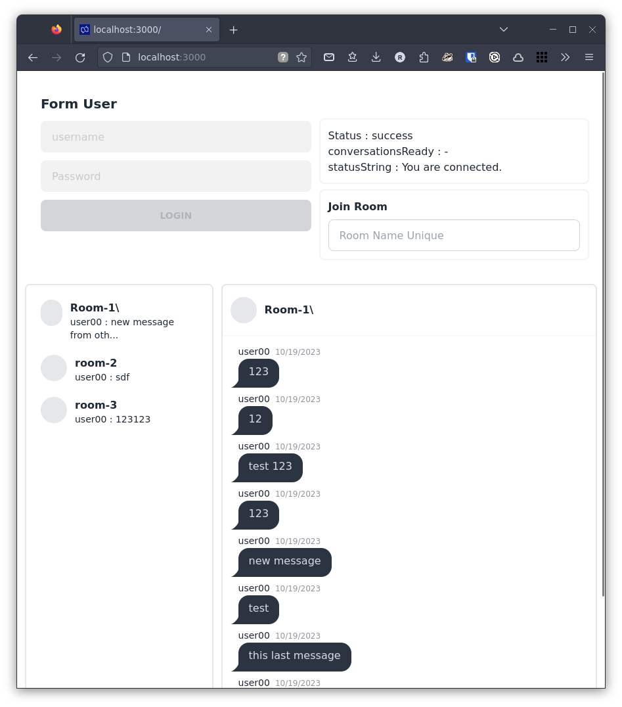

# Conversation Twilio Demo

## requirement 
```
nodejs : v18.16.1
```

## Instalation

Run Install
```
npm install
```

add .env from example `.env.example`

Run
```
npm run dev
```

## Access Token Generating

Env need fill with URL twilio token service. Create access token service by follow this url [https://github.com/twilio/twilio-conversations-demo-react#generating-access-tokens](https://github.com/twilio/twilio-conversations-demo-react#generating-access-tokens).

## How to use

1. insert username and password
2. click login
3. Create Room at `Join Room` section.
4. Try Chat and interact with roomo



## limitation

- Can't add other participant
- only basic create room and send message
